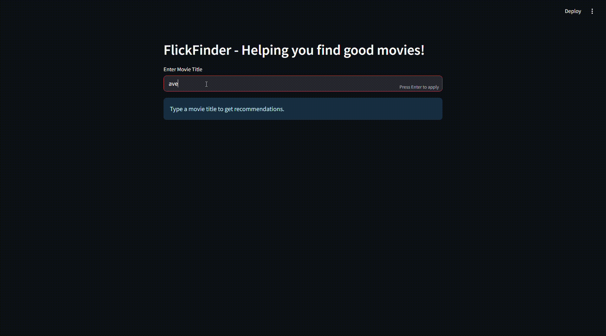

# 🎬 FlickFinder - Movie Recommendation System

**FlickFinder** is a content-based movie recommendation app built with **Streamlit**. It helps you discover movies similar to the one you love, using natural language processing (NLP) techniques on movie overviews. The app also supports fuzzy search to handle typos and shows the most relevant matches!

---

## 🚀 Features

- 🔍 **Fuzzy Matching**: Handles typos and suggests the closest matching movie titles.
- 🧠 **Content-Based Filtering**: Uses TF-IDF and cosine similarity on movie descriptions.
- 🎯 **Sorting Options**: Get recommendations sorted by:
  - Popularity
  - User Rating (weighted by vote count)
  - Release Date
- ⚡ **Interactive UI**: Built with Streamlit for a clean and responsive user experience.

---

## 📁 Dataset

The app uses the [TMDB 10000 Movies Dataset](https://www.kaggle.com/datasets/muqarrishzaib/tmdb-10000-movies-dataset) from Kaggle, containing movie titles, overviews, ratings, popularity, and more.

If you're using `kagglehub`, you can download it programmatically:
```python
import kagglehub
kagglehub.dataset_download("muqarrishzaib/tmdb-10000-movies-dataset")
````

Otherwise, manually download and place it under:

```
datasets/muqarrishzaib/tmdb-10000-movies-dataset/versions/1/TMDB 10000 Movies Dataset.csv
```

---

## 🧰 Tech Stack

* **Python**
* **Streamlit** - UI framework
* **Pandas** - Data handling
* **Scikit-learn** - TF-IDF and cosine similarity
* **TheFuzz** - Fuzzy matching
* **KaggleHub** (optional) - Downloading Kaggle datasets

## 🎞️ Demo


